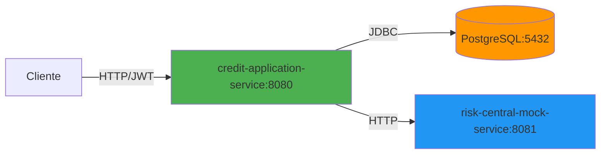
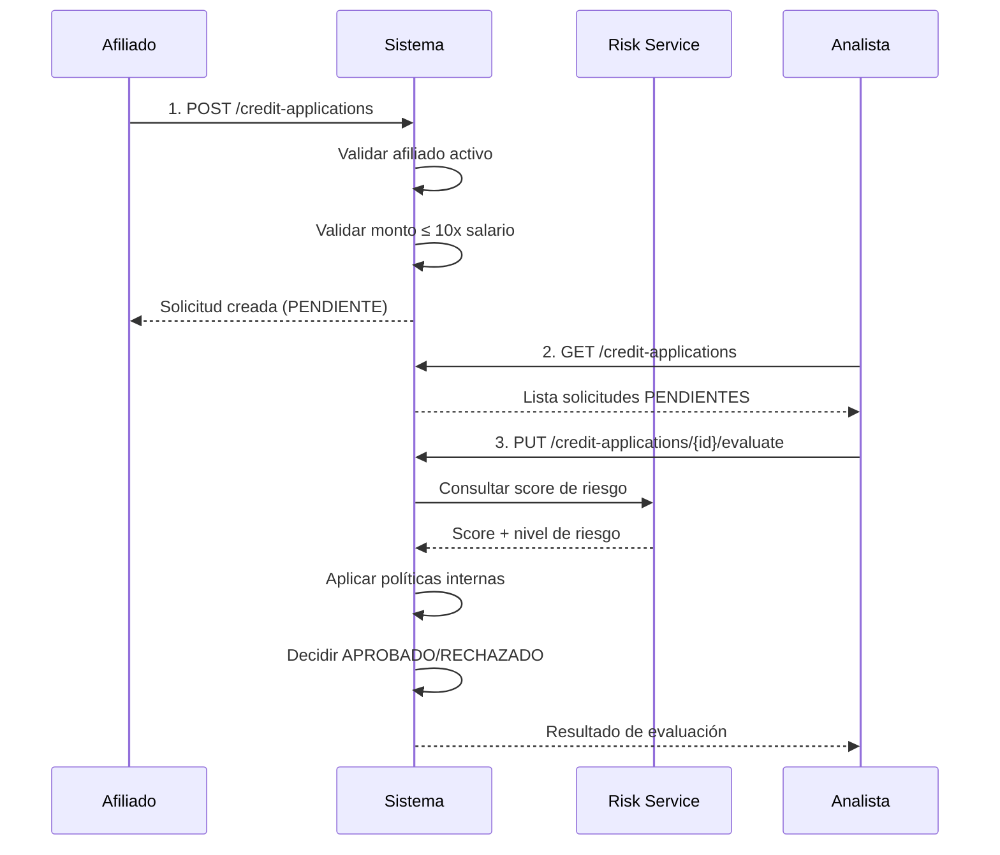
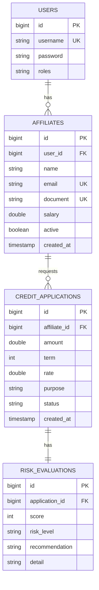

# 🏦 CoopCredit - Sistema de Gestión de Créditos

Sistema profesional de microservicios para gestión de solicitudes de crédito con evaluación automatizada de riesgo, implementado con arquitectura hexagonal y estándares empresariales.

## 📋 Tabla de Contenidos

- [Descripción](#-descripción)
- [Arquitectura](#-arquitectura)
- [Tecnologías](#-tecnologías)
- [Instalación](#-instalación)
- [API Endpoints](#-api-endpoints)
- [Flujo de Negocio](#-flujo-de-negocio)
- [Seguridad y Roles](#-seguridad-y-roles)
- [Pruebas](#-pruebas)
- [Observabilidad](#-observabilidad)

---

## 🎯 Descripción

CoopCredit automatiza el proceso completo de solicitud y evaluación de créditos para cooperativas de ahorro y crédito, proporcionando:

- **Gestión de Afiliados**: Registro y actualización de información de afiliados
- **Solicitudes de Crédito**: Creación y seguimiento de solicitudes
- **Evaluación Automatizada**: Integración con servicio de riesgo crediticio
- **Políticas Internas**: Validación de cuota/ingreso, monto máximo y capacidad de endeudamiento
- **Seguridad**: Autenticación JWT con control de acceso basado en roles
- **Trazabilidad**: Registro completo de todas las operaciones

---

## 🏗 Arquitectura

### Arquitectura Hexagonal

El servicio principal implementa arquitectura hexagonal (Ports & Adapters):

```
┌─────────────────────────────────────────┐
│      INFRASTRUCTURE LAYER               │
│  ┌──────────┐  ┌──────────┐  ┌───────┐ │
│  │ REST API │  │PostgreSQL│  │ HTTP  │ │
│  └────┬─────┘  └────┬─────┘  └───┬───┘ │
│       │             │             │     │
│  ┌────┴─────────────┴─────────────┴───┐ │
│  │      APPLICATION LAYER              │ │
│  │    (Use Cases / Services)           │ │
│  └────┬────────────────────────────────┘ │
│       │                                  │
│  ┌────┴────────────────────────────────┐ │
│  │        DOMAIN LAYER                 │ │
│  │  (Models, Ports, Business Rules)    │ │
│  └─────────────────────────────────────┘ │
└─────────────────────────────────────────┘
```

### Microservicios



**Servicios:**

1. **credit-application-service** (8080)
   - Gestión de afiliados
   - Solicitudes de crédito
   - Evaluación con políticas internas
   - Autenticación y autorización

2. **risk-central-mock-service** (8081)
   - Simulación de central de riesgo
   - Evaluación determinística por documento
   - Penalización por monto y plazo

---

## 🛠 Tecnologías

### Backend
- **Java 21** (credit-application-service: Java 17)
- **Spring Boot 3.2.0**
- **Spring Security** + JWT
- **Spring Data JPA** + Hibernate
- **PostgreSQL 15**
- **Flyway** (migraciones)
- **MapStruct** (mapeo de objetos)
- **Lombok** (reducción de boilerplate)

### Observabilidad
- **Spring Boot Actuator**
- **Micrometer** + Prometheus

### Testing
- **JUnit 5**
- **Mockito**
- **Testcontainers**
- **MockMvc**

### Documentación
- **SpringDoc OpenAPI 3** (Swagger UI)

### Contenerización
- **Docker** + **Docker Compose**
- Multi-stage builds

---

## 🚀 Instalación

### Requisitos Previos

- Docker 20.10+
- Docker Compose 2.0+

### Ejecución Local

```bash
# Clonar repositorio
git clone <repository-url>
cd Cop-credit

# Levantar servicios
docker-compose up --build

# Detener servicios
docker-compose down

# Detener y limpiar volúmenes
docker-compose down -v
```

### Acceso a Servicios

| Servicio | URL | Descripción |
|----------|-----|-------------|
| Credit Application API | http://localhost:8080 | API principal |
| Swagger UI (Credit) | http://localhost:8080/swagger-ui/index.html | Documentación interactiva |
| Risk Mock API | http://localhost:8081 | Servicio de riesgo |
| Swagger UI (Risk) | http://localhost:8081/swagger-ui/index.html | Documentación risk service |
| Actuator | http://localhost:8080/actuator | Métricas y health checks |
| PostgreSQL | localhost:5432 | Base de datos |

**Credenciales PostgreSQL:**
- Usuario: `postgres`
- Password: `postgres`
- Base de datos: `coopcredit`

---

## 📡 API Endpoints

### Autenticación

#### POST /auth/register
Registrar nuevo usuario.

**Request:**
```json
{
  "username": "usuario",
  "password": "password123",
  "role": "ROLE_AFILIADO"
}
```

**Roles disponibles:** `ROLE_AFILIADO`, `ROLE_ANALISTA`, `ROLE_ADMIN`

#### POST /auth/login
Autenticar usuario.

**Request:**
```json
{
  "username": "usuario",
  "password": "password123"
}
```

**Response:**
```json
{
  "token": "eyJhbGciOiJIUzUxMiJ9...",
  "roles": ["ROLE_AFILIADO"]
}
```

### Afiliados

#### POST /affiliates
Crear afiliado (ROLE_ADMIN, ROLE_ANALISTA).

**Request:**
```json
{
  "name": "María González",
  "email": "maria@example.com",
  "document": "9876543210",
  "salary": 5000000
}
```

#### PUT /affiliates/{id}
Actualizar afiliado (ADMIN, ANALISTA).

**Request:**
```json
{
  "name": "María González",
  "email": "maria.nueva@example.com",
  "document": "9876543210",
  "salary": 5500000
}
```

### Solicitudes de Crédito

#### POST /credit-applications
Crear solicitud de crédito (AFILIADO, ADMIN).

**Request:**
```json
{
  "affiliateId": 1,
  "amount": 10000000,
  "term": 24,
  "rate": 1.5,
  "purpose": "Compra de vehículo"
}
```

**Response:**
```json
{
  "id": 1,
  "affiliateId": 1,
  "amount": 10000000,
  "term": 24,
  "rate": 1.5,
  "purpose": "Compra de vehículo",
  "status": "PENDIENTE",
  "createdAt": "2025-12-09T10:00:00",
  "riskEvaluation": null
}
```

#### PUT /credit-applications/{id}/evaluate
Evaluar solicitud pendiente (ANALISTA, ADMIN).

**Response:**
```json
{
  "id": 1,
  "affiliateId": 1,
  "amount": 10000000,
  "term": 24,
  "rate": 1.5,
  "purpose": "Compra de vehículo",
  "status": "APROBADO",
  "createdAt": "2025-12-09T10:00:00",
  "riskEvaluation": {
    "id": 1,
    "score": 750,
    "recommendation": "APROBADO"
  }
}
```

#### GET /credit-applications
Listar solicitudes (AFILIADO, ANALISTA, ADMIN).

**Comportamiento por rol:**
- **AFILIADO**: Solo sus propias solicitudes
- **ANALISTA**: Solo solicitudes PENDIENTES
- **ADMIN**: Todas las solicitudes

### Risk Service

#### POST /risk-evaluation
Evaluar riesgo crediticio.

**Request:**
```json
{
  "documento": "9876543210",
  "monto": 10000000,
  "plazo": 24
}
```

**Response:**
```json
{
  "documento": "9876543210",
  "score": 750,
  "nivelRiesgo": "BAJO",
  "detalle": "Excelente historial crediticio. Totalmente aprobado."
}
```

---

## 🔄 Flujo de Negocio

### Flujo Completo de Solicitud



### Políticas de Evaluación

#### 1. Validaciones Previas (al crear)
- ✅ Afiliado debe estar activo
- ✅ Monto ≤ 10x salario del afiliado

#### 2. Evaluación de Riesgo
**Score del Risk Service:**
- **300-500**: ALTO riesgo → Rechazado automáticamente
- **501-950**: MEDIO/BAJO riesgo → Continúa a políticas internas

#### 3. Políticas Internas
- **Monto Máximo**: amount ≤ salary × 10
- **Cuota/Ingreso**: Cuota mensual ≤ 30% del salario

**Cálculo de cuota:**
```
Cuota = (Monto × Tasa%) / (1 - (1 + Tasa%)^(-Plazo))
```

#### 4. Decisión Final
- Si **Risk Service = RECHAZADO** → RECHAZADO
- Si **alguna política interna falla** → RECHAZADO
- Si **todo pasa** → APROBADO

---

## 🔐 Seguridad y Roles

### Autenticación
- **Tipo**: JWT (JSON Web Tokens)
- **Algoritmo**: HS512
- **Expiración**: 1 hora
- **Encriptación**: BCrypt para contraseñas

### Roles y Permisos

| Endpoint | AFILIADO | ANALISTA | ADMIN |
|----------|----------|----------|-------|
| POST /auth/register | ✅ | ✅ | ✅ |
| POST /auth/login | ✅ | ✅ | ✅ |
| POST /affiliates | ❌ | ✅ | ✅ |
| PUT /affiliates/{id} | ❌ | ✅ | ✅ |
| POST /credit-applications | ✅ | ❌ | ✅ |
| PUT /credit-applications/{id}/evaluate | ❌ | ✅ | ✅ |
| GET /credit-applications | ✅ (propias) | ✅ (pendientes) | ✅ (todas) |

### Uso del Token

```bash
# 1. Obtener token
curl -X POST http://localhost:8080/auth/login \
  -H "Content-Type: application/json" \
  -d '{"username": "usuario", "password": "password"}'

# 2. Usar token en requests
curl -X GET http://localhost:8080/credit-applications \
  -H "Authorization: Bearer <TOKEN>"
```

---

## 🧪 Pruebas

### Estructura de Tests

```
src/test/java/
├── application/service/
│   ├── EvaluateCreditApplicationServiceTest.java
│   └── RegisterCreditApplicationServiceTest.java
├── infrastructure/adapter/in/web/
│   └── CreditApplicationControllerTest.java
└── AbstractIntegrationTest.java
```

### Tipos de Pruebas

**Unit Tests:**
- Casos de uso del dominio
- Lógica de negocio pura
- Mock de dependencias externas

**Integration Tests:**
- Endpoints REST con MockMvc
- Seguridad JWT
- Testcontainers con PostgreSQL real

### Ejecutar Tests

Los tests se ejecutan automáticamente durante el build de Docker:

```bash
docker-compose up --build
```

Si el build completa exitosamente, todos los tests pasaron.

---

## 📊 Observabilidad

### Actuator Endpoints

| Endpoint | Descripción |
|----------|-------------|
| /actuator/health | Estado del servicio |
| /actuator/info | Información de la aplicación |
| /actuator/metrics | Métricas de Micrometer |
| /actuator/prometheus | Métricas en formato Prometheus |

### Métricas Disponibles

- **http.server.requests**: Tiempo de respuesta por endpoint
- **jvm.memory.used**: Uso de memoria
- **jvm.threads.live**: Threads activos
- **system.cpu.usage**: Uso de CPU
- **jdbc.connections.active**: Conexiones DB activas

### Health Checks

```bash
curl http://localhost:8080/actuator/health
```

**Response:**
```json
{
  "status": "UP",
  "components": {
    "db": {
      "status": "UP"
    },
    "diskSpace": {
      "status": "UP"
    }
  }
}
```

---

## 📦 Colección Postman

El proyecto incluye una colección Postman completa con todos los endpoints:

**Archivo:** `CoopCredit-API-Collection.postman_collection.json`

**Incluye:**
- Autenticación (registro y login)
- Gestión de afiliados
- Solicitudes de crédito
- Evaluación de riesgo
- Variables de entorno

**Importar en Postman:**
1. Abrir Postman
2. Import → Upload Files
3. Seleccionar `CoopCredit-API-Collection.postman_collection.json`

---

## 🗂 Modelo de Datos

### Diagrama ER



---

## 🎯 Casos de Uso

### Caso 1: Solicitud Aprobada

**Escenario:**
- Afiliado con salario $5,000,000
- Solicita $20,000,000 a 36 meses
- Tasa 1.2% mensual

**Validaciones:**
- ✅ Monto (20M) < 10x salario (50M)
- ✅ Score: 750 (BAJO riesgo)
- ✅ Cuota: ~$700,000 (14% del salario)

**Resultado:** APROBADO

### Caso 2: Rechazado por Cuota Alta

**Escenario:**
- Afiliado con salario $4,000,000
- Solicita $30,000,000 a 12 meses
- Tasa 2.0% mensual

**Validaciones:**
- ✅ Monto (30M) < 10x salario (40M)
- ✅ Score: 680 (MEDIO riesgo)
- ❌ Cuota: ~$2,800,000 (70% del salario)

**Resultado:** RECHAZADO

### Caso 3: Rechazado por Score Bajo

**Escenario:**
- Afiliado con salario $6,000,000
- Solicita $10,000,000 a 24 meses
- Tasa 1.5% mensual

**Validaciones:**
- ✅ Monto (10M) < 10x salario (60M)
- ❌ Score: 450 (ALTO riesgo)

**Resultado:** RECHAZADO

---

## 📝 Notas Técnicas

### Algoritmo de Risk Service

El servicio de riesgo utiliza un algoritmo determinístico:

1. **Base Score**: Generado a partir del hash del documento (300-950)
2. **Penalización por Monto**: -50 puntos por cada $10M sobre $5M (máx -200)
3. **Penalización por Plazo**: -30 puntos por cada 12 meses sobre 24 (máx -150)
4. **Score Final**: Base - Penalizaciones (limitado a 300-950)

**Ejemplo:**
- Documento: "1007729845" → Base: 827
- Monto: $50M → Penalización: -225 (limitado a -200)
- Plazo: 60 meses → Penalización: -90
- **Score Final**: 827 - 200 - 90 = 537 (MEDIO)

### Validaciones de Entrada

**Límites:**
- Monto: $1,000 - $1,000,000,000
- Plazo: 1 - 360 meses
- Salario: > $0

---

## 🤝 Contribución

Para contribuir al proyecto:

1. Fork del repositorio
2. Crear rama feature (`git checkout -b feature/nueva-funcionalidad`)
3. Commit cambios (`git commit -m 'Agregar nueva funcionalidad'`)
4. Push a la rama (`git push origin feature/nueva-funcionalidad`)
5. Crear Pull Request

---

## 📄 Licencia

Este proyecto es privado y confidencial.

---
